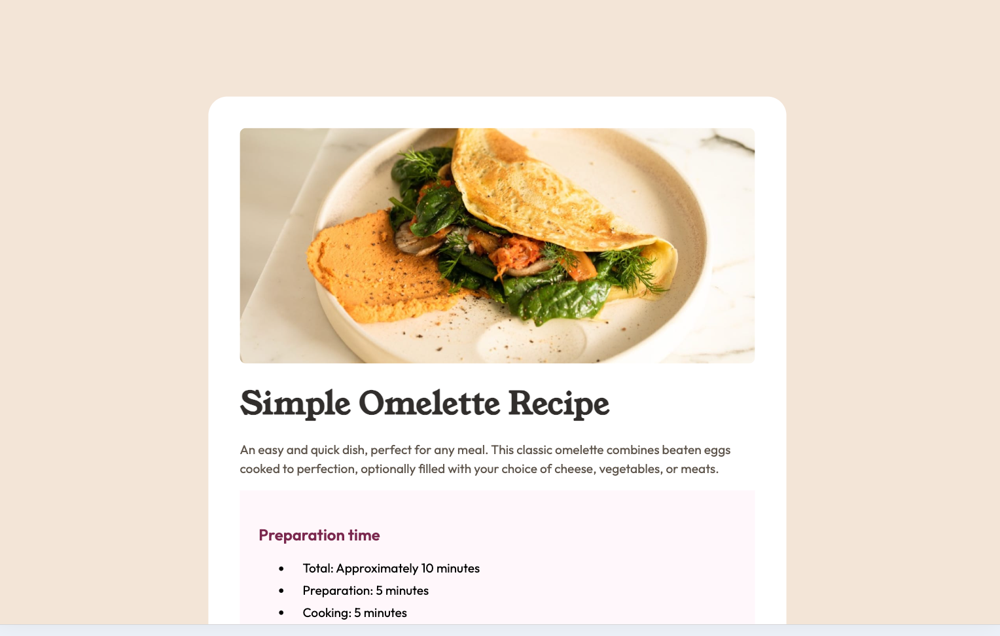

# 🍳 Frontend Mentor – Recipe Page Solution

This is my solution to the [Recipe Page](https://www.frontendmentor.io/challenges/recipe-page-KiTsR8QQKm) challenge on Frontend Mentor.

## 📸 Screenshot

## 🔗 Links

- 🔴 **Live Site**: [https://bruchno.github.io/recipe-page/](https://bruchno.github.io/recipe-page/)
- 🧩 **Repository**: [https://github.com/Bruchno/recipe-page](https://github.com/Bruchno/recipe-page)
- 🎯 **Solution on Frontend Mentor**: *link pending*

## ⚙️ Built With

- Semantic HTML5
- CSS3 with Flexbox
- Responsive layout using rem, clamp(), and logical properties
- Accessibility-aware styling (prefers-reduced-motion, contrast)
- Custom properties (CSS variables) for consistency
- Mobile-first design
- Git & GitHub workflow

## ✨ Highlights

- 💛 Styled with accessibility and internationalization in mind
- 🧮 Dynamic spacing using modern CSS functions like clamp() and calc()
- 🦄 Clean, scalable design with centralized variables
- 🌍 Language-agnostic layout using logical properties

## 🙋‍♀️ Author

- GitHub – [@Bruchno](https://github.com/Bruchno)
- Frontend Mentor – [@Bruchno](https://www.frontendmentor.io/profile/Bruchno)

---

This project reflects my ongoing growth in frontend development. Feedback and suggestions are always welcome!
